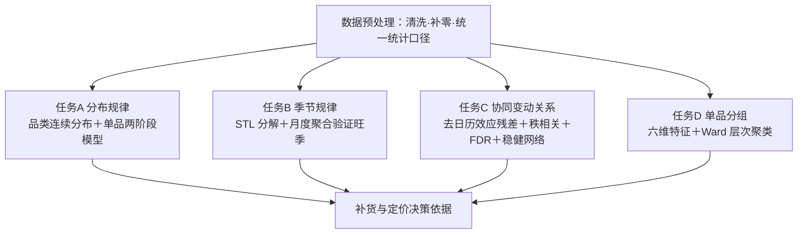

# 论文标题（待定）

## 摘要

针对问题一：本文基于某商超 2020 年 7 月 1 日至 2023 年 6 月 30 日的蔬菜销售流水数据，从分布规律、季节规律、相关关系与单品分组四个层面，系统刻画蔬菜类商品销售量的时间分布特征以及品类之间、单品之间的关联结构。首先，对品类日销量拟合对数正态与伽马分布并以 AIC/BIC 选型，对单品日销量建立"售出概率＋条件正销量分布"的两阶段模型刻画零膨胀特征；其次，采用 STL 将品类日销量分解为趋势、季节与残差分量，以季节强度、趋势强度量化各成分的相对大小，并按月度聚合验证 4-10 月旺季假设；再次，剔除星期与月份日历效应后计算单品残差的 Spearman 秩相关，以 BH-FDR 控制多重检验，经相关系数阈值建边与前后半样本稳定性检验构建协同变动网络，揭示品类与单品间的正向同步与潜在替代关系；最后，从日频时序中提取六维特征，经标准化后以 Ward 层次聚类将单品划分为五类，为后续补货与定价决策提供分组依据。全部数值结果均经独立重算校验，模型具有较好的稳健性与可解释性。

针对问题二：待写。

针对问题三：待写。

针对问题四：待写。

关键词： 销量分布；STL 季节分解；去季节相关网络；层次聚类；FDR 多重检验

## 一、 引言

### 1.1问题背景

生鲜商超是城市居民日常消费的重要渠道，其中蔬菜类商品因消费频率高、需求刚性强的特点，在商超经营中占据关键地位。然而，蔬菜类商品保鲜期短、品相变化快，商超需按日进行补货。并且，由于蔬菜品种与产地繁多，且进货交易时间集中在凌晨3:00至4:00，商超往往在信息不完全的情况下做出当日补货决策。同时，蔬菜类商品在需求侧呈现出销售量与时间关联关系，在供给侧中则表现出季节性，以及与销售空间限制的紧密联系。在此背景下，如何依据历史销售数据、批发价格和损耗率等信息，科学制定蔬菜类商品的补货、定价、销售组合策略，已成为生鲜商超经营管理的核心问题之一。

### 1.2研究意义

基于以上背景，本研究具有重要的理论意义和实际应用价值。

从理论层面来看，生鲜产品的定价与库存补货问题一直是运营管理和运筹优化领域的研究热点。蔬菜类商品兼具易逝性、季节性、品类多样性等复杂特征，其销售受价格、时间、品类间关联关系等多重因素影响。通过建立数学模型系统分析蔬菜各品类及单品的销售分布规律、品类间的相互关联关系以及销售总量与定价之间的函数关系，可以丰富生鲜产品运营管理领域的理论研究成果，为后续相关研究提供方法参考。

从实践层面来看，本题所研究的商超面临的补货与定价决策问题，是生鲜零售行业的普遍性难题。生鲜类商品保质期短、损耗高，传统的依赖经验的人工判断往往采用"一刀切"式的打折方式，不仅损失毛利，也难以实现收益最大化。通过数据驱动的数学建模方法，对蔬菜类商品进行科学的销售规律分析、需求预测和优化决策，可以帮助商超制定更加合理的补货总量、单品组合和定价策略，在满足市场需求的同时实现收益最大化，具有直接的商业应用价值。此外，问题四所涉及的数据采集建议，对于商超进一步完善数据体系、提升决策智能化水平具有前瞻性的指导意义。

### 1.3问题重述

本题基于某商超经销的 6 个蔬菜品类的商品信息（附件 1）、2020 年 7 月 1 日至2023 年 6 月 30 日的销售流水明细数据（附件 2）与批发价格数据（附件 3），以及各商品近期的损耗率数据（附件 4），解决以下四个问题：

问题一：要求基于附件 1、2 等数据来源，分析各蔬菜品类及单品在销售量上的分布规律，如时间分布特征（季节性、周期性等），并揭示相关关系，如不同品类之间、不同单品之间可能存在的互补或替代关系，为后续补货与定价决策提供依据。

问题二：要求基于附件 1、2、3、4 等数据来源，在品类层面上建立销售总量与成本加成定价之间的关系模型，并在此基础上确定未来一周（2023年7月1日至7日）日补货总量和定价策略，以最大化商超的总收益。

问题三：要求基于附件2等数据来源，在可售单品总数控制在27至33个，且各单品订购量满足最小陈列量 2.5 千克的基础下，根据 2023 年 6 月 24 日至 30 日的可售品种，制定7月1日的单品补货量和定价策略，在尽量满足市场需求前提下，使得商超收益最大。

问题四：要求从优化制定蔬菜类商品补货和定价决策的角度出发，识别当前数据体系的不足，提出补充采集数据的意见和理由，并论述这些数据如何帮助解决上述问题。

## 二、 总体分析

问题一要求回答两个层面的问题：一是"分布规律"，即各蔬菜品类及单品销售量的时间分布特征（季节性、周期性等）；二是"相关关系"，即不同品类之间、不同单品之间可能存在的互补或替代关系。二者共同为后续补货与定价决策提供依据。本文按"单点分布→时间分解→横向关联→纵向分组"的逻辑，将问题一分解为四个递进的子任务：

- 任务 A（分布规律）：以品类连续分布拟合刻画品类日销量的概率形态，以"售出概率＋条件正销量分布"的两阶段模型刻画单品日销量的零膨胀特征；
- 任务 B（季节规律）：以 STL 将品类日销量分解为趋势、季节与残差分量，量化周季节强度，并以月度聚合验证年内的旺季假设；
- 任务 C（协同变动关系）：先剔除星期与月份日历效应，再计算残差的 Spearman秩相关，以 BH-FDR 控制多重检验，按阈值建边并经前后半样本检验筛选稳健边，构建单品协同变动网络并计算中心度；
- 任务 D（单品分组）：提取销售频率、销量水平、波动幅度、周末与节假日响应等六维时序特征，经标准化后以 Ward 层次聚类对单品分组，为差异化选品提供依据。

四个子任务共用同一套清洗后的日销量数据与统计口径，结果互相衔接：分布与季节规律刻画"卖多少、何时卖"，协同网络揭示"与谁一起变动"，聚类分组给出"谁该重点经营"，共同构成问题一完整的技术路线，技术路线图如下所示。



## 三、 模型假设

为简化问题，本文做出以下假设：

- 假设1：单周期零库存假设。每日凌晨到货的蔬菜品质一致，当日未售罄部分全额损耗，不结转次日（支撑独立报童模型）。
- 假设2：需求价格独立假设。短期内定价调整不影响顾客对商超的长期忠诚度，即单日需求仅由当期价格决定。
- 假设3：损耗率稳定假设。附件4提供的近期损耗率在预测期（2023年7月1-7日）内保持恒定。
- 假设4：批发价可观测假设。未来一周批发价采用最近可得均价（2023-06-24至06-30）作为已知常数。
- 假设5：需求独立与无后向转移假设。各日期的市场需求相互独立，当日因缺货未被满足的消费者需求不会顺延至次日（即不存在需求积压或跨期替代），因此每日可独立使用报童模型求解。
- 假设6：数据可靠假设。附件数据经清洗后能够准确反映商品销售信息，退货量占总流水比重极小（461/878503），可直接忽略或从净销量中扣除，不影响分布规律分析。
- 假设7：日历效应线性可加假设。星期与月份对日销量的影响可线性叠加，可用含星期、月份虚拟变量的线性回归剔除，剩余残差主要反映单品自身的需求波动。
- 假设8：补零口径假设。某单品在完整日历上无销售记录的日期视为销量为 0，参与分布、分解与相关分析，以统一时间轴。

## 四、 符号说明

| 符号 | 含义 | 单位 |
| --- | --- | --- |
| $i, c, t$ | 单品索引、品类索引、日期 | — |
| $T$ | 完整观测期天数，$T=1095$ | 天 |
| $q_{c,t}, q_{i,t}$ | 品类/单品日净销量 | kg |
| $f(x;\theta)$ | 候选分布密度函数，$\theta$ 为分布参数 | — |
| $n_i, p_i$ | 单品有效销售天数、售出概率 | 天、— |
| $T_t, S_t, R_t$ | STL 趋势、季节、残差分量 | kg |
| $F_s, F_t$ | 季节强度、趋势强度 | — |
| $\rho_c$ | 品类旺季比值（4-10 月与 11-3 月平均日销量之比） | — |
| $e_{it}$ | 单品日历效应回归残差 | kg |
| $r_{ij}, p, q$ | Spearman 秩相关系数、$p$ 值、BH-FDR 校正后的 $q$ 值 | — |
| $m$ | 单品对检验个数，$m=8646$ | — |
| $z, k$ | 标准化特征矩阵、聚类簇数 | — |
| $\mathrm{sil}, \mathrm{ARI}$ | silhouette 系数、调整兰德指数 | — |

表1 符号说明

## 五、 问题一的模型建立与求解

### 5.1问题分析

问题一包含"分布规律"与"相关关系"两层目标。分布规律层面要求刻画品类与单品销售量的统计形态与时间特征：品类日销量为连续正值且右偏，单品日销量则存在大量零值（无销售日），需要分别处理；时间特征包括周内周期与年内季节。相关关系层面要求揭示品类间、单品间在销量上的协同变动，进而为互补/替代关系提供线索，但直接对原始日销量计算相关会混入共同的日历与季节成分，产生大量伪相关，必须先去除日历效应。

基于上述分析，本文将问题一拆解为四个子模型：分布模型（任务 A）、季节分解模型（任务 B）、去季节相关网络模型（任务 C）与时序特征聚类模型（任务 D）。四个模型循序渐进：先刻画"卖多少"的分布，再刻画"何时卖"的季节，然后剔除时间效应揭示"与谁一起卖"的关联，最后按需求形态对单品"分组管理"。

### 5.2模型准备

#### 5.2.1 数据来源与清洗

本部分使用的数据为 2020-07-01 至 2023-06-30 的销售流水明细（附件 2）与商品信息（附件 1）。原始流水共 878,503 行，其中退货 461 行（占 0.05%）；涉及 6 个品类、251 个单品，售出总量 471,275.839 kg，退货总量 -299.921 kg。数据预处理包括：

- 将销售日期缺失或单品编码无效的记录剔除，退货记录以负销量并入净销量口径；
- 按"日期×单品"将流水聚合为单品日销量表（46,599 行），再按品类汇总为品类日销量表（6,474 行），全部净销量为正值（品类最小日销量 0.252 kg）；
- 以完整日历 2020-07-01 至 2023-06-30（共 $T=1095$ 天）为基准对各序列补零，使各品类、各单品的时间轴对齐。

#### 5.2.2 统计口径

- 完整观测期 2020-07-01 至 2023-06-30，共 $T=1095$ 天；
- 品类日销量按完整日历补零，共 $6\times1095=6570$ 个品类-日，其中补零 96 个品类-日；单品日销量同样按完整日历补零；
- 分布拟合仅使用正销量样本 $q>0$；单品有效销售天数 $n_i\ge60$ 的单品进入参数拟合与后续分析（共 132 个），$n_i<60$ 的稀疏单品仅报告经验分位数；
- 日历效应控制变量：星期虚拟变量（基准周一）与月份虚拟变量（基准 1 月），含截距项。

### 5.3模型建立

#### 5.3.1 品类与单品销量分布模型（任务 A）

品类日销量为连续正值、右偏长尾，选用对数正态分布（lognormal）与伽马分布（gamma）两类连续分布拟合，并以 AIC/BIC 选型。

对数正态分布：若 $\ln X \sim N(\mu, s^2)$，则 $X\sim\mathrm{LogNormal}(s,0,\mathrm{scale})$（固定 $\mathrm{loc}=0$），密度函数为

$$f(x)=\frac{1}{x\,s\sqrt{2\pi}}\exp\left(-\frac{(\ln x-\mu)^2}{2s^2}\right),\quad x>0$$

其中 $s$ 为对数标准差，$\mathrm{scale}=e^\mu$ 为尺度参数，且$E[X]=\mathrm{scale}\cdot e^{s^2/2}$，$\mathrm{Var}(X)=\mathrm{scale}^2(e^{s^2}-1)e^{s^2}$。

伽马分布：固定 $\mathrm{loc}=0$，记为 $X\sim\mathrm{Gamma}(a,0,\mathrm{scale})$，密度函数为

$$f(x)=\frac{x^{a-1}e^{-x/\mathrm{scale}}}{\Gamma(a)\,\mathrm{scale}^a},\quad x>0$$

其中 $a$ 为形状参数，$\mathrm{scale}$ 为尺度参数，且 $E[X]=a\cdot\mathrm{scale}$，$\mathrm{Var}(X)=a\cdot\mathrm{scale}^2$。两类分布自由参数个数相同（均为 2），AIC/BIC 可直接比较。

设某品类正销量样本 $x_1,\dots,x_n$，参数 $\theta$ 由最大似然估计得到：

$$L(\theta)=\prod_{i=1}^{n}f(x_i;\theta),\qquad
\mathrm{LLF}=\ln L(\hat\theta)=\sum_{i=1}^{n}\ln f(x_i;\hat\theta)$$

$$\mathrm{AIC}=2k-2\mathrm{LLF},\qquad \mathrm{BIC}=k\ln n-2\mathrm{LLF}$$

其中 $k$ 为自由参数个数，$n$ 为正销量天数；AIC/BIC 取值越小表示模型越优，本文以AIC 选型、BIC 交叉核对。

单品日销量存在大量无销售日，采用两阶段模型：令 $Y_t=\mathbf{1}\{q_t>0\}$ 表示第 $t$ 日是否销售，则 $Y_t\sim\mathrm{Bernoulli}(p_i)$，售出概率取经验频率$p_i=n_i/T$；正销量条件分布 $q_t\mid Y_t=1\sim f(q;\theta_i)$ 按 AIC 在对数正态与伽马之间选优。单品日销量的整体分布为混合分布：

$$f(q)=(1-p_i)\,\delta_0(q)+p_i\,f(q;\theta_i),\quad q\ge0$$

其中 $\delta_0$ 为 0 点的点质量。对 $n_i<60$ 的稀疏单品不做参数估计，仅报告经验分位数 $Q_\tau=\inf\{x:F(x)\ge\tau\}$（$\tau=0.5,0.9,0.99$ 对应 P50、P90、P99）。

#### 5.3.2 季节规律模型（任务 B）

采用 STL 对品类日销量做加性分解：

$$y_t = T_t + S_t + R_t$$

其中 $T_t$ 为趋势项，$S_t$ 为季节项，$R_t$ 为残差项。STL 通过内层与外层循环迭代执行 loess 平滑估计各分量，对离群值具有鲁棒性。本文取季节周期 $\mathrm{period}=7$（周内季节）并启用 $\mathrm{robust}=True$。

以方差分解度量季节与趋势成分的相对强度：

$$F_s=\max\left(0,\;1-\frac{\mathrm{Var}(R_t)}{\mathrm{Var}(S_t+R_t)}\right),\qquad
F_t=\max\left(0,\;1-\frac{\mathrm{Var}(R_t)}{\mathrm{Var}(T_t+R_t)}\right)$$

$F_s$、$F_t\in[0,1]$，越接近 1 表示该成分对总波动的贡献越大。

观测期仅 3 年，365 天周期循环数不足，年季节改用月度聚合刻画。按月份聚合平均日销量 $\bar y_{c,m}$，定义旺季为 4-10 月、淡季为 11-3 月，旺季比值

$$\rho_c=\frac{\bar y_{c,\mathrm{peak}}}{\bar y_{c,\mathrm{off}}}$$

$\rho_c>1$ 表示品类 $c$ 旺季平均日销量高于淡季。

#### 5.3.3 去季节协同变动网络模型（任务 C）

单品日销量同时受日历效应与自身需求驱动，直接计算相关系数会产生由共同季节因素导致的伪相关，故先剔除日历效应。对每个单品 $i$ 拟合线性模型

$$q_{it}=\alpha_i+\sum_{k=1}^{6}\delta_k D^{\mathrm{wk}}_{kt}
+\sum_{m=1}^{11}\eta_m D^{\mathrm{mo}}_{mt}+\varepsilon_{it}$$

其中 $D^{\mathrm{wk}}_{kt}$、$D^{\mathrm{mo}}_{mt}$ 分别为星期与月份虚拟变量，参数由最小二乘估计；残差 $e_{it}=q_{it}-\hat q_{it}$ 为去日历效应后的销量序列。

对残差序列按日秩变换后取 Pearson 相关，得到 Spearman 秩相关系数

$$r_{ij}=\mathrm{corr}\big(\mathrm{rank}(e_i),\,\mathrm{rank}(e_j)\big)$$

在原假设 $r_{ij}=0$ 下，检验统计量 $t=\dfrac{r_{ij}\sqrt{n-2}}{\sqrt{1-r_{ij}^2}}\sim t_{n-2}$，双侧 $p$ 值为 $p=2\big(1-F_t(|t|;n-2)\big)$。对全部 $m$ 个单品对的 $p$ 值做BH-FDR 校正：

$$q_{(i)}=\min_{j\ge i}\left\{\frac{m}{j}p_{(j)}\right\}$$

其中 $p_{(1)}\le\cdots\le p_{(m)}$ 为排序后的 $p$ 值。建边条件为$|r_{ij}|\ge0.4$ 且 $q_{ij}<0.05$。随后将样本按时间分为前半（2020-07-01 至2021-12-31）与后半（2022-01-01 至 2023-06-30），分别执行相同的残差化与秩相关检验，若某条边在两半中均满足 $p<0.05$ 且符号与全样本一致，则记为稳健边。

以单品为节点、稳健边为边构建无向图，边权为相关系数，按符号区分正负相关；节点中心性采用度中心度与介数中心度，用于识别销量协同变动中的关键单品。

#### 5.3.4 单品时序特征聚类模型（任务 D）

对每个单品 $i$ 提取六维特征刻画其需求形态：

$$\mathrm{售出天数占比}\quad p_i=\frac{n_i}{T},\qquad
\mathrm{有售日均销量}\quad \mu_i=\frac{1}{n_i}\sum_{q_{it}>0}q_{it}$$

$$\mathrm{有售日变异系数}\quad \mathrm{CV}_i=\frac{1}{\mu_i}
\sqrt{\frac{1}{n_i-1}\sum_{q_{it}>0}(q_{it}-\mu_i)^2}$$

$$\mathrm{周末偏置}\quad w_i=\frac{\bar q_{i,\mathrm{weekend}}}
{\bar q_{i,\mathrm{weekday}}}-1,\qquad
\mathrm{节假日脉冲}\quad h_i=\frac{\bar q_{i,\mathrm{holiday}}}
{\bar q_{i,\mathrm{non\text{-}holiday}}}-1$$

$$\mathrm{总销量占比}\quad s_i=\frac{\sum_t q_{it}}
{\sum_j\sum_t q_{jt}}$$

其中均值均基于补零后的完整日序列计算，变异系数仅基于正销量样本以避免零值膨胀失真；节假日集合取中国法定节假日（含调休）。对六维特征做 z-score 标准化后计算欧式距离，采用 Ward 最小方差法层次聚类；对 $k\in\{3,\dots,10\}$ 分别计算 silhouette系数，取 silhouette 最大且不小于 0.15 的 $k$ 为最优簇数。稳定性评估采用 80% 抽样重复聚类 50 次，以调整兰德指数（ARI）度量抽样结果与全量聚类的一致性，取平均报告。

### 5.4模型求解与结果分析

#### 5.4.1 分布拟合结果（任务 A）

各品类正销量天数分别为 1085、1084、1085、1050、1085、1085，合计 6,474。AIC 选型结果：花叶类、花菜类、水生根茎类、茄类为伽马分布，辣椒类、食用菌为对数正态分布；AIC 与 BIC 选型完全一致，参数估计结果见表 2。独立重算 AIC 与输出结果的偏差不超过 $5\times10^{-4}$，可归因于数值保留三位小数。

| 品类 | 最优分布 | 形状/对数标准差 | 尺度参数 | AIC | BIC |
| --- | --- | --- | --- | ---: | ---: |
| 花叶类 | gamma | 5.2599 | 34.8338 | 12444.912 | 12454.891 |
| 花菜类 | gamma | 2.9925 | 12.8900 | 9548.503 | 9558.480 |
| 水生根茎类 | gamma | 1.6376 | 22.8694 | 9898.119 | 9908.098 |
| 茄类 | gamma | 2.8055 | 7.6219 | 8059.611 | 8069.525 |
| 辣椒类 | lognorm | 0.5365 | 72.8523 | 11037.887 | 11047.866 |
| 食用菌 | lognorm | 0.6123 | 58.3107 | 10841.520 | 10851.499 |

表2 品类日销量的最优分布与 AIC/BIC

246 个有售单品中，132 个进入参数拟合（伽马 81 个、对数正态 51 个），有效销售天数介于 61 至 1076 天，售出概率介于 0.0557 至 0.9818；114 个稀疏单品仅报告经验分位数；另有 5 个单品无销售记录，不参与分析。经验分位数（P50/P75/P90/P95/P99）、有效销售天数与售出概率均经独立重算校验，与输出结果一致（最大偏差 $5\times10^{-4}$，为舍入误差）。

图 1（q1_dist_cat_qq.pdf）为各品类最优分布的 QQ 图：设 $F^{-1}(p)$ 与$F_n^{-1}(p)$ 分别为理论分布与样本经验分位数函数，QQ 图绘制 $(F^{-1}(p),F_n^{-1}(p))$在 $p\in(0,1)$ 上的散点，点列越贴近直线 $y=x$，经验分布与理论分布越一致。各品类中部拟合良好、两端略有偏离，说明分布主体可由所选分布近似。

图 2（q1_dist_item_sample.pdf）为代表性单品（高频、中频、稀疏各 2 个）的拟合对比图：直方图为正销量样本的经验密度估计，曲线为最优分布密度，直观展示高频单品分布较集中、稀疏单品波动较大的差异。

#### 5.4.2 季节规律结果（任务 B）

各品类季节强度介于 0.1729 至 0.2616，趋势强度介于 0.5135 至 0.6268，说明品类日销量以趋势成分为主，周季节成分中等偏弱；旺季检验结果见表 3。

| 品类 | 季节强度 | 趋势强度 | 旺季平均日销量 | 淡季平均日销量 | 旺季比值 |
| --- | --- | --- | --- | --- | --- |
| 花叶类 | 0.2114 | 0.5518 | 188.110 | 171.871 | 1.0945 |
| 花菜类 | 0.2182 | 0.5135 | 38.311 | 37.975 | 1.0089 |
| 水生根茎类 | 0.1729 | 0.5389 | 30.206 | 46.748 | 0.6462 |
| 茄类 | 0.2385 | 0.6268 | 24.015 | 15.582 | 1.5412 |
| 辣椒类 | 0.2001 | 0.5174 | 78.951 | 90.792 | 0.8696 |
| 食用菌 | 0.2616 | 0.5729 | 56.150 | 88.527 | 0.6343 |

表3 品类季节强度、趋势强度与旺季检验结果

旺季比值超过 1 的品类为花叶类、花菜类与茄类；水生根茎类、辣椒类与食用菌淡季日销量反而更高。可见 4-10 月供给丰富并不必然对应销量高峰。月度形态上，花叶类在 8 月达到峰值（263.722 kg/日），茄类在 7 月（31.193）、辣椒类在 2 月（115.314）、食用菌在 1 月（105.700）、花菜类在 8 月（52.982）、水生根茎类在 1 月（65.530）分别达到年内高点。季节强度、趋势强度与旺季比值均经独立重算校验，与输出结果偏差不超过 $5\times10^{-5}$，可归因于数值保留小数。

图 3（q1_stl.pdf）为 6 个品类的 STL 三分量图：每个面板绘制趋势、季节与残差三条曲线，并标注该品类的季节强度与趋势强度；季节分量呈现明显的周内起伏，残差围绕零波动。

图 4（q1_monthly_mean.pdf）为月度平均日销量柱状图：横轴为月份 1-12，纵轴为平均日销量；红色柱对应 4-10 月，蓝色柱对应 11-3 月，直观展示各品类销量在年度内的分布形态。

#### 5.4.3 协同变动网络结果（任务 C）

进入分析的 132 个单品共 8,646 个单品对。满足 $|r|\ge0.4$ 且 $q<0.05$ 的主边共1,062 条，其中正相关 820 条、负相关 242 条；通过前后半样本检验的稳健边 154 条，构成包含 51 个节点的协同变动网络。相关系数阈值敏感性见表 4。

| 阈值 | 边数 | 正边数 | 负边数 | 稳健边数 |
| --- | ---: | ---: | ---: | ---: |
| 0.3 | 1848 | 1289 | 559 | 249 |
| 0.4 | 1062 | 820 | 242 | 154 |
| 0.5 | 523 | 456 | 67 | 81 |

表4 相关系数阈值敏感性分析

品类级去季节残差的 Spearman 相关中，花菜类与食用菌（0.651）、花菜类与辣椒类（0.636）、辣椒类与食用菌（0.638）相关较强；茄类与其余品类的相关最弱（$|r|$ 均小于 0.14）。单品级网络中，度中心度最高的单品为红椒(1)（0.38）、小米椒（0.36）、青线椒（0.32）、红杭椒（0.32）、姬菇(包)（0.30）与大白菜（0.30），且以正相关边为主，说明辣椒类、食用菌与叶菜类单品存在明显的正向同步变动。独立重算校验：随机抽取200 条主边重算相关系数与 FDR $q$ 值，相关系数最大偏差 $5\times10^{-5}$，$q$ 值与statsmodels 的 BH 校正结果一致；全部输出无缺失值。

图 5（q1_corr_heatmap_cat.pdf）为品类级去季节残差的 6×6 Spearman 相关热图，格内标注相关系数，颜色越深表示相关越强。

图 6（q1_corr_network.pdf）为单品级协同变动网络：红色边表示正相关、蓝色边表示负相关，节点大小与度数成正比，并标注中心度最高的 10 个单品。

#### 5.4.4 单品聚类结果（任务 D）

132 个单品的最优簇数为 $k=5$，对应 silhouette 系数 0.2583；50 次 80% 抽样聚类的平均 ARI 为 0.4567，聚类结构基本稳定。各簇画像见表 5。

| 簇 | 单品数 | 售出天数占比 | 有售日均销量 | 有售日变异系数 | 周末偏置 | 节假日脉冲 | 总销量占比 | 建议命名 |
| --- | ---: | ---: | ---: | ---: | ---: | ---: | ---: | --- |
| 1 | 13 | 0.3236 | 27.4374 | 0.6927 | 0.3466 | 0.3544 | 0.0207 | 高量周末脉冲型 |
| 2 | 7 | 0.8384 | 20.7024 | 0.7215 | 0.4876 | 0.5192 | 0.0414 | 高频平稳型 |
| 3 | 55 | 0.2053 | 4.7746 | 0.7616 | 0.2129 | 0.2126 | 0.0025 | 低频稀疏型 |
| 4 | 34 | 0.1908 | 6.1442 | 0.7681 | 0.5531 | 0.5963 | 0.0028 | 低频脉冲型 |
| 5 | 23 | 0.5631 | 7.3427 | 1.0807 | 0.3617 | 0.4005 | 0.0091 | 周末脉冲型 |

表5 单品聚类画像

各簇特征差异明显：簇 2（高频平稳型）售出天数占比高达 0.8384，是稳定的主销品类；簇 1（高量周末脉冲型）有售日均销量达 27.44 kg，但售出占比仅 0.32，呈现"高量低频"特征；簇 3（低频稀疏型）与簇 4（低频脉冲型）售出占比均低于 0.21，其中簇 4的周末偏置（0.5531）与节假日脉冲（0.5963）显著更高，适合节假日备货；簇 5（周末脉冲型）售出占比 0.56，变异系数 1.08，波动较大。聚类标签与独立重算的 Ward 聚类结果完全一致，特征值最大偏差约 $10^{-14}$（浮点精度），ARI 重算结果一致，全部输出无缺失值。

图 7（q1_dendrogram.pdf）为 Ward 层次聚类树状图，展示单品逐级合并的层次结构。

图 8（q1_silhouette.pdf）为 $k\in\{3,\dots,10\}$ 的 silhouette 曲线，红色虚线标出最优簇数 $k=5$。

图 9（q1_cluster_profile.pdf）为各簇标准化特征均值曲线，反映簇间的特征差异，与表 5 的画像相互印证。

图表均输出为 PDF 矢量格式，图内不设大标题，图题由论文正文给出。

## 六、 问题二的模型建立与求解

### 6.1问题分析

待写。

### 6.2模型准备

待写。

### 6.3模型建立

待写。

### 6.4模型求解与结果分析

待写。

## 七、 问题三的模型建立与求解

### 7.1问题分析

待写。

### 7.2模型准备

待写。

### 7.3模型建立

待写。

### 7.4模型求解与结果分析

待写。

## 八、 问题四的模型建立与求解

### 8.1问题分析

待写。

### 8.2模型准备

待写。

### 8.3模型建立

待写。

### 8.4模型求解与结果分析

待写。

## 九、 模型的分析与检验

### 9.1灵敏度分析

（1）相关网络阈值灵敏度。相关系数阈值取 0.3、0.4、0.5 时，主边数分别为 1,848、1,062、523，稳健边数分别为 249、154、81（表 4）。主边数与稳健边数随阈值提高单调下降，但度中心度排名靠前的单品（红椒(1)、小米椒、青线椒等）在不同阈值下基本保持，说明网络核心结构对阈值选择不敏感，结论稳健。

（2）聚类簇数灵敏度。$k\in\{3,\dots,10\}$ 的 silhouette 系数均大于 0.15，最优值出现在 $k=5$（0.2583），与 $k=6$（0.2579）非常接近，说明 $k=5$ 的选择稳健；簇内样本量（7~55）合理，无单例簇或超大簇，分组粒度适宜。

（3）时间稳定性检验。任务 C 要求稳健边在前半（2020-07-01 至 2021-12-31）与后半（2022-01-01 至 2023-06-30）样本中均显著且符号一致，1,062 条主边中通过检验的稳健边 154 条（占 14.5%），显著低于单一时期显著边占比，说明筛选有效剔除了随时间不稳定的伪关联；任务 D 的 80% 抽样重复聚类平均 ARI 为 0.4567，聚类结构基本稳定。

### 9.2误差分析

为验证数值可靠性，对全部关键输出做了独立重算：

- 分布拟合：独立重算 AIC 与输出结果偏差不超过 $5\times10^{-4}$，可归因于输出数值保留三位小数；
- 季节分解：季节强度、趋势强度与旺季比值重算偏差不超过 $5\times10^{-5}$；
- 相关网络：随机抽取 200 条主边重算相关系数与 BH-FDR $q$ 值，相关系数最大偏差 $5\times10^{-5}$，$q$ 值与 statsmodels 的 BH 校正结果一致；
- 聚类：聚类标签与独立重算的 Ward 聚类结果完全一致，特征值最大偏差约$10^{-14}$（浮点精度），ARI 重算结果一致。

误差来源主要为数值保留小数位导致的舍入误差与浮点运算精度，均在可接受范围内；全部输出表（q1_dist_cat.csv、q1_stl_fit.csv、q1_corr_edges.csv、q1_item_cluster.csv等）无缺失值。

## 十、 模型的评价、改进与推广

### 10.1模型的优点

- 优点1：问题导向的组合建模框架。分布、季节、网络、聚类四个模型覆盖"单点形态—时间分解—横向关联—纵向分组"完整证据链，结果互相衔接，直接服务于补货与定价决策。
- 优点2：有效处理时间序列伪相关。任务 C 先剔除星期与月份日历效应，再以Spearman 秩相关与 BH-FDR 控制多重检验，并引入前后半样本稳定性筛选，从方法上避免了共同季节因素导致的伪相关。
- 优点3：针对性刻画数据特征。单品两阶段分布刻画零膨胀、变异系数仅基于正销量样本、聚类特征区分周末与节假日响应，均贴合蔬菜零售数据特点。
- 优点4：结果可复现、可校验。全部数值经独立重算核对，输出结构化，运行脚本与日志完整，便于结果复核与后续扩展。

### 10.2模型的缺点

- 缺点1：观测期仅 3 年，365 天年度周期循环数不足，年季节效应只能以月度聚合近似，无法精细刻画年度季节形态。
- 缺点2：日历效应采用线性可加假设，未考虑星期、月份之间以及价格等因素的交互作用，残差中仍可能残留少量非线性成分。
- 缺点3：相关网络阈值（0.4）与聚类命名规则带有一定主观性；相关系数仅刻画单调同步关系，无法直接判定互补/替代，最终判定需结合价格弹性。

### 10.3模型的改进

- 引入更长的观测期或外部数据（气候、节假日、竞品信息），采用月度 STL、TBATS等模型刻画年度季节；
- 用广义可加模型（GAM）或局部加权回归代替线性日历效应剔除，允许星期与月份效应非线性叠加；
- 用高斯图模型（GGM）、偏相关网络或动态时间规整（DTW）刻画条件依赖与形态相似性，并以交叉价格弹性检验互补/替代关系；
- 聚类特征可扩展加入趋势、谱特征或深度嵌入特征，并以外部验证指标辅助选簇。

### 10.4模型的推广

本模型的思路与流程可推广至其他生鲜品类（水果、肉禽、水产等）及全品类零售场景，用于销量分布刻画、季节性备货、品类关联与单品分组管理；协同变动网络方法亦可用于区域市场联动、电商平台商品共现与"购物篮"分析，具有较好的通用性。

## 参考文献

编号沿用主参考文献表，仅列问题一所引用的条目（[3]、[6]、[7] 由问题二至四引用）。

[1] Akaike H. A new look at the statistical model identification[J]. IEEE Transactions on Automatic Control, 1974, 19(6): 716-723. doi:10.1109/TAC.1974.1100705

[2] Schwarz G. Estimating the dimension of a model[J]. The Annals of Statistics, 1978, 6(2): 461-464. doi:10.1214/aos/1176344136

[4] D'Agostino R B, Stephens M A. Goodness-of-Fit Techniques[M]. New York: Marcel Dekker, 1986.

[5] Mullahy J. Specification and testing of some modified count data models[J]. Journal of Econometrics, 1986, 33(3): 341-365. doi:10.1016/0304-4076(86)90002-3

[8] Silver E A, Pyke D F, Thomas D J. Inventory and Production Management in Supply Chains[M]. 4th ed. Boca Raton: CRC Press, 2016.

[9] Cleveland R B, Cleveland W S, McRae J E, et al. STL: A seasonal-trend decomposition procedure based on loess[J]. Journal of Official Statistics, 1990, 6(1): 3-73.

[10] Wang X, Smith K, Hyndman R. Characteristic-based clustering for time series data[J]. Data Mining and Knowledge Discovery, 2006, 13(3): 335-364. doi:10.1007/s10618-005-0039-x

[11] Hyndman R J, Athanasopoulos G. Forecasting: Principles and Practice[M]. 2nd ed. Melbourne: OTexts, 2018. https://otexts.com/fpp2/

[12] Spearman C. The proof and measurement of association between two things[J]. American Journal of Psychology, 1904, 15(1): 72-101. doi:10.2307/1412159

[13] Yule G U. Why do we sometimes get nonsense correlations between time-series? A study in sampling and the nature of time-series[J]. Journal of the Royal Statistical Society, 1926, 89(1): 1-63. doi:10.1111/j.2397-2335.1926.tb01829.x

[14] Granger C W J, Newbold P. Spurious regressions in econometrics[J]. Journal of Econometrics, 1974, 2(2): 111-120. doi:10.1016/0304-4076(74)90034-7

[15] Wooldridge J M. Econometric Analysis of Cross Section and Panel Data[M]. 2nd ed. Cambridge, MA: MIT Press, 2010.

[16] Benjamini Y, Hochberg Y. Controlling the false discovery rate: A practical and powerful approach to multiple testing[J]. Journal of the Royal Statistical Society: Series B, 1995, 57(1): 289-300. doi:10.1111/j.2517-6161.1995.tb02031.x

[17] Tumminello M, Aste T, Di Matteo T, et al. A tool for filtering information in complex systems[J]. Proceedings of the National Academy of Sciences, 2005, 102(30): 10421-10426. doi:10.1073/pnas.0500298102

[18] Mantegna R N. Hierarchical structure in financial markets[J]. The European Physical Journal B, 1999, 11(1): 193-197. doi:10.1007/s100510050929

[19] Freeman L C. A set of measures of centrality based on betweenness[J]. Sociometry, 1977, 40(1): 35-41. doi:10.2307/3033543

[20] Wasserman S, Faust K. Social Network Analysis: Methods and Applications[M]. Cambridge: Cambridge University Press, 1994.

[21] Deaton A, Muellbauer J. Economics and Consumer Behavior[M]. Cambridge: Cambridge University Press, 1980.

[22] Mas-Colell A, Whinston M D, Green J R. Microeconomic Theory[M]. New York: Oxford University Press, 1995.

[23] Ward J H. Hierarchical grouping to optimize an objective function[J]. Journal of the American Statistical Association, 1963, 58(301): 236-244. doi:10.1080/01621459.1963.10500845

[24] Murtagh F, Legendre P. Ward's hierarchical agglomerative clustering method: Which algorithms implement Ward's criterion?[J]. Journal of Classification, 2014, 31(3): 274-295. doi:10.1007/s00357-014-9161-z

[25] Kaufman L, Rousseeuw P J. Finding Groups in Data: An Introduction to Cluster Analysis[M]. New York: Wiley, 1990.

[26] Rousseeuw P J. Silhouettes: A graphical aid to the interpretation and validation of cluster analysis[J]. Journal of Computational and Applied Mathematics, 1987, 20: 53-65. doi:10.1016/0377-0427(87)90125-7

[27] Hubert L, Arabie P. Comparing partitions[J]. Journal of Classification, 1985, 2(1): 193-218. doi:10.1007/BF01908075

## 附录 A 文件清单

| 文件名 | 功能说明 |
| --- | --- |
| code/question1/A.py | 品类/单品销量分布拟合与模型选型 |
| code/question1/B.py | 品类日销量 STL 季节分解与旺季检验 |
| code/question1/C.py | 去季节相关网络构建与中心度计算 |
| code/question1/D.py | 单品时序特征提取与 Ward 层次聚类 |
| results/q1_dist_cat.csv | 品类分布拟合结果（含 AIC/BIC） |
| results/q1_dist_item.csv | 单品两阶段分布拟合结果 |
| results/q1_item_quantiles.csv | 单品经验分位数（P50-P99） |
| results/q1_stl_fit.csv | STL 分解表（趋势/季节/残差） |
| results/q1_seasonal_strength.csv | 季节强度、趋势强度与旺季比值 |
| results/q1_monthly_mean.csv | 月度平均日销量 |
| results/q1_corr_edges.csv | 单品相关边表（含 FDR q 值与稳健边标记） |
| results/q1_corr_threshold.csv | 相关系数阈值敏感性表 |
| results/q1_network_top.csv | 网络中心度表 |
| results/q1_item_cluster.csv | 单品聚类标签 |
| results/q1_cluster_profile.csv | 簇画像与建议命名 |
| results/q1_cluster_k.csv | 簇数选择结果（silhouette 与 ARI） |
| figures/q1_dist_cat_qq.pdf | 品类最优分布 QQ 图 |
| figures/q1_dist_item_sample.pdf | 代表性单品拟合对比图 |
| figures/q1_stl.pdf | STL 三分量图 |
| figures/q1_monthly_mean.pdf | 月度平均日销量柱状图 |
| figures/q1_corr_heatmap_cat.pdf | 品类级相关热图 |
| figures/q1_corr_network.pdf | 单品协同变动网络图 |
| figures/q1_dendrogram.pdf | Ward 层次聚类树状图 |
| figures/q1_silhouette.pdf | silhouette 曲线图 |
| figures/q1_cluster_profile.pdf | 簇特征均值曲线图 |
| code/question1/outputs/A.log~D.log | 各任务运行日志 |

表6 程序与结果文件清单

运行环境：Python 3.13（numpy、pandas、scipy、statsmodels、sklearn、networkx、matplotlib、chinese-calendar）。运行命令：`D:\Python3.13.12\python.exe code\question1\A.py`（B.py/C.py/D.py 同理）。

## 附录 B 关键代码

任务 A（分布拟合与 AIC/BIC 选型）：

```python
def fit(x, name):
    d = dists[name]                        # dists = {"lognorm": stats.lognorm, "gamma": stats.gamma}
    par = d.fit(x, floc=0)                 # 固定 loc=0 的 MLE
    llf = np.sum(d.logpdf(x, *par))
    aic = 2 * k[name] - 2 * llf            # k[name] = 2
    bic = k[name] * np.log(len(x)) - 2 * llf
    return par, llf, aic, bic

def best_fit(x):
    best = None
    for name in dists:
        par, llf, aic, bic = fit(x, name)
        if best is None or aic < best[2]:
            best = (name, par, aic)
    return best
```

任务 B（STL 分解与成分强度）：

```python
def decomp(s):
    res = STL(s, period=7, robust=True).fit()
    return res.trend, res.seasonal, res.resid

def strength(t, s, r):
    fs = max(0.0, 1 - np.var(r) / np.var(s + r))
    ft = max(0.0, 1 - np.var(r) / np.var(t + r))
    return fs, ft
```

任务 C（日历效应残差与 BH-FDR）：

```python
def resid(q, x):
    r = np.empty_like(q, dtype=float)
    for i in range(q.shape[1]):
        b, *_ = np.linalg.lstsq(x, q[:, i], rcond=None)  # 星期+月份虚拟变量回归
        r[:, i] = q[:, i] - x @ b
    return r

def bh(p):                                   # Benjamini-Hochberg FDR 校正
    m = len(p)
    order = np.argsort(p)
    q = np.empty(m)
    q[order] = p[order] * m / np.arange(1, m + 1)
    q = np.minimum.accumulate(q[::-1])[::-1]
    return q
```

任务 D（Ward 层次聚类与簇数选择）：

```python
def pick_k(z):                               # z 为标准化后的六维特征
    lnk = hierarchy.linkage(z, method="ward")
    rows = [(k, silhouette_score(z, hierarchy.fcluster(
        lnk, t=k, criterion="maxclust"))) for k in range(3, 11)]
    best = max(rows, key=lambda r: r[1])[0]
    return lnk, rows, best
```
